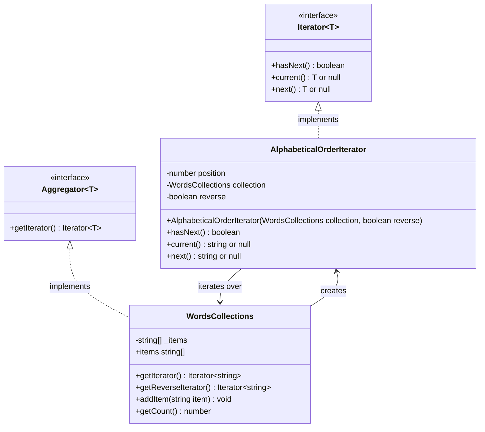

# Iterator Pattern - Class Diagram (WordsCollections)

## Relationships

- **WordsCollections** implements **Aggregator&lt;string&gt;** interface
- **AlphabeticalOrderIterator** implements **Iterator&lt;string&gt;** interface
- **WordsCollections** creates and returns **AlphabeticalOrderIterator** instances
- **AlphabeticalOrderIterator** holds a reference to **WordsCollections** to traverse its items

## Pattern Flow

1. Client creates a `WordsCollections` instance
2. Client adds items using `addItem()`
3. Client requests an iterator via `getIterator()` or `getReverseIterator()`
4. WordsCollections instantiates and returns an `AlphabeticalOrderIterator`
5. Client uses iterator methods (`hasNext()`, `next()`) to traverse the collection
6. The iterator maintains its own position state independently of the collection
